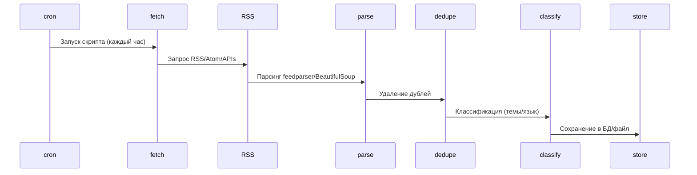

# Краткое резюме 
Для агрегации сигналов по визионерству, диза­рупту и автоиндустрии используют микс **техно-СМИ, отраслевых порталов, блогов** и **академических артиклей**. Ключевые источники: **Habr** (RSS по темам IT), **VC и RBTH** (рос. техно-СМИ), **TechCrunch/MIT Tech Review/The Verge** (глобальные техно-СМИ), **АвтоНовости** (авто-СМИ), **arXiv** (RSS-потоки по темам AI и mobility), **Google Scholar Alerts** (или Email Alerts), и **правительственные базы** (RVC, НТИ, аналитика). Также полезны отраслевые блоги компаний (Tesla, Waymo, Bosch) и Telegram (TGStat для RSS).

- **Форматы доступа:** RSS/Atom (Habr, arXiv, СМИ), API (ограничено; например Medium API или RSS-to-JSON), сайт без RSS – HTML-парсинг (BeautifulSoup). Инструменты: Python `feedparser`, `requests`, cron.
- **Автоматизация:** крон «0 * * * *» запускает Python-скрипт; скрипт скачивает RSS, парсит, фильтрует по ключевым словам (например «mobility», «автономный», «AI», «инновация») и тематикам (мобильность, этика, стратегия). Дедупликация по ID/URL. Хранение — БД или файловая система.
- **Примеры:** RSS Habr: `https://habr.com/ru/rss/flows/featured/`; Medium-тэги через rss2json; ArXiv AI (cs.AI): `http://export.arxiv.org/rss/cs.AI`. 
- **Ключевые слова/фильтры:** mobility, smart city, EV, autonomous, AI, future, disrupt, UX, sustainability.
- **Конвейер:** cron → fetch (feedparser/requests) → парсинг → очистка/filtration → кластеризация (text-анализ) → база. Можно использовать open source (FeedParser, Huginn, Apache Nutch, spaCy).

| Источник            | Описание                  | Тематика             | Язык | Частота | Доступ        | Стоимость | Надежность |
|---------------------|---------------------------|----------------------|------|---------|---------------|-----------|------------|
| Habr.io            | IT-блог/медиа             | tech, AI, futurism   | RU   | Постоянно| RSS, API?     | бесплатно | высокая    |
| arXiv (cs.AI)       | Академ. препринты         | AI, mobility        | ENG  | Ежедневно| RSS, API     | бесплатно | высоко     |
| TechCrunch         | Техно новости             | tech, startup       | ENG  | Ежедневно| RSS, API     | бесплатно | высокая    |
| MIT Tech Review    | Технологии                | AI, digital        | ENG  | Ежедневно| RSS, API     | бесплатно | высокая    |
| VC.ru              | Рос. техно медиа          | innovation, digital | RU   | Ежедневно| RSS          | бесплатно | средняя    |
| AutoNews.ru        | Автомобили                | auto, mobility     | RU   | Ежедневно| RSS          | бесплатно | средняя    |
| Министерство прома | Госданные                 | mobility, tech     | RU   | По потребности| API, CSV   | бесплатно | высокая    |
| Tesla Blog         | Корпоративный блог        | авто, AI            | ENG  | Еженедельно| RSS          | бесплатно | высокая    |
| TGStat (mobility)  | Телеграм ленты            | mobility, futurism | RU   | Ежедневно| RSS           | бесплатно | неизвестна|
| Google Alerts      | Персональные оповещения   | любые темы         | ENG/RU| По запросу| Email       | бесплатно | средняя    |



**Пример кода (Python):** 
```python
import feedparser
url = "https://habr.com/ru/rss/flows/featured/"
feed = feedparser.parse(url)
for entry in feed.entries:
    if any(k in entry.title.lower() for k in ["mobility","автономн","инновац"]):
        print(entry.title, entry.link)
```
