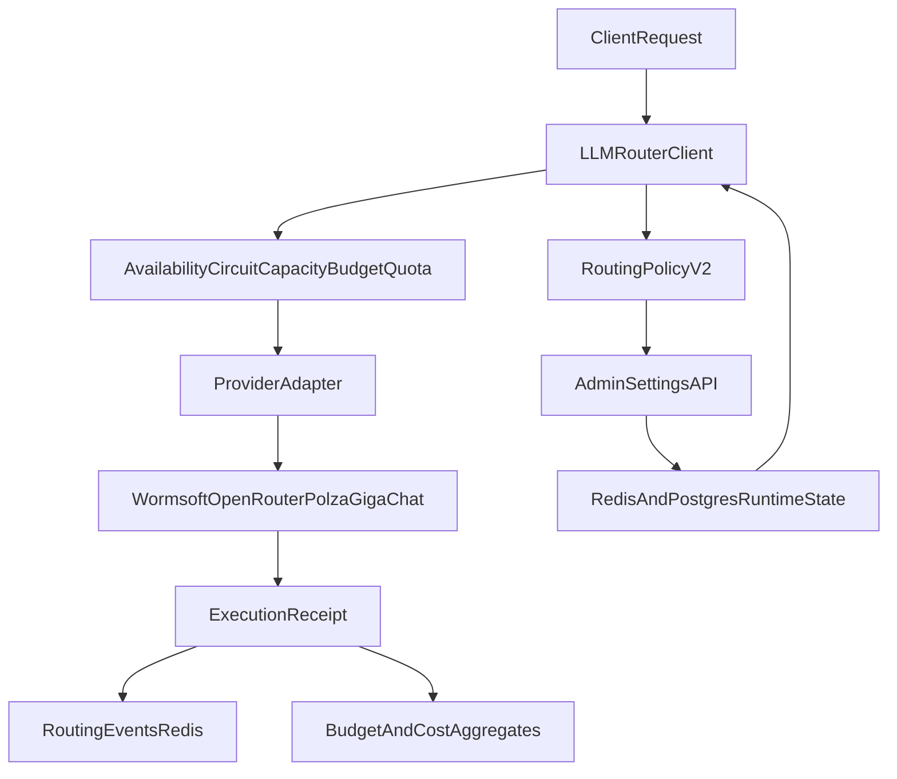

# LLM Orchestrator Audit (As-Is / To-Be)

Дата: 2026-05-08  
Область: runtime-оркестрация `text_generation`, `vision_generation`, `embeddings`.

## 1) Scope и допущения

- Этот документ фиксирует текущее состояние оркестратора по коду и продовым runtime-сигналам.
- Фокус: маршрутизация провайдеров/моделей, fallback, circuit/budget/guard, control-plane API, observability.
- Источники:
  - `worker/llm_router_client.py`
  - `worker/provider_adapters.py`
  - `worker/provider_budget_manager.py`
  - `worker/provider_circuit_breaker.py`
  - `worker/provider_quota_guard.py`
  - `worker/wormsoft_guard.py`
  - `shared/llm_control_plane.py`
  - `shared/llm_routing.py`
  - `admin/backend/routers/settings.py`
  - `admin/backend/services/llm_control_plane.py`
  - `docs/openrouter-dynamic-routing.md`
  - `docs/llm-cost-strategy.md`
  - `prometheus/alerts.yml`
  - `grafana/dashboards/frontier-runtime.json`

## 2) Архитектура As-Is

### 2.1 Компоненты

- `LLMRouterClient` — runtime-фасад, который принимает `chat/vision/embed`, строит цепочку кандидатов и исполняет fallback.
- `ProviderAdapter`-слой:
  - `WormsoftAdapter` (text),
  - `OpenRouterAdapter` (text + vision),
  - `PolzaAdapter` (text + vision),
  - `GigaChatAdapter` (text + vision + embeddings).
- `ProviderCircuitBreaker` — provider/model circuit state в Redis.
- `ProviderBudgetManager` — runtime-бюджеты и finops-агрегаты.
- `ProviderPublishedQuotaGuard` — admission-check по published snapshots (OpenRouter key, GigaChat balance).
- `WormsoftSharedGuard` — общий guard по интервалам/карантину/429.
- `RoutingPolicyV2` + `LLMRoutingSettings` — policy/control-plane модель маршрутизации.

### 2.2 Control-plane

Через `admin /api/settings/*`:

- `runtime-mode` — overlay режимы.
- `llm-routing` — task-level routing legacy payload.
- `policy` — `RoutingPolicyV2` (family-level candidates/mode).
- `simulate` — dry-run routing.
- `provider-state`, `budget-state`, `circuits`, `routing-events` — диагностика runtime.

State mirror:
- Postgres: `admin_runtime_settings`.
- Redis: `frontier:runtime:*`, `llm:circuit:*`, `llm:budget:*`, `llm:cost:*`, `wormsoft:*`, `or:*`.

### 2.3 High-level flow

## 3) Потоки исполнения

### 3.1 `text_generation`

Порядок на попытку кандидата:
1. provider availability
2. circuit reserve
3. adapter capacity reserve
4. runtime budget allow/reserve
5. published quota allow
6. execute
7. commit + finops receipt + events

На fail — release + fallback к следующему кандидату.

### 3.2 `vision_generation`

- Кандидаты идут из policy + runtime fallback chain.
- Для OpenRouter применяется guard/picker логика и деградация в Polza/Giga при лимитах/ошибках.
- Записываются fallback-метрики по reason.

### 3.3 `embeddings`

- Текущий default: strict-профиль с single-provider (GigaChat embeddings).
- В случае деградации fallback ограничен policy; это intentional для стабильности embedding-profile.

## 4) Наблюдаемость (As-Is)

### 4.1 Что уже покрыто

- Request/fallback/cost/token counters (`frontier_llm_requests_total`, `frontier_llm_fallbacks_total`, `frontier_llm_cost_*`).
- Provider-specific health and quota metrics (Wormsoft/OpenRouter/GigaChat).
- Alerting по fallback spikes, finops drift, stale snapshots, provider rate-limits (`prometheus/alerts.yml`).

### 4.2 Пробелы

- Dashboard `frontier-runtime` в основном ориентирован на runtime-resilience и GigaChat; coverage по provider-orchestrator decision path неравномерный.
- Нужна более явная визуализация цепочки причин fallback (throttle vs provider outage vs quota).
- Нужен единый runbook для ключевых LLM alert classes.

## 5) Риски и технический долг (As-Is)

- Перекос нагрузки в одного primary-провайдера при деградации fallback может резко менять стоимость.
- При stale admin snapshots published-quota check может быть менее информативным.
- Strict embeddings-профиль требует явного operational-runbook на деградацию.
- Нужен строгий раздел «локальный throttle vs реальная недоступность upstream» в SLO-терминах.

## 6) Best Practices (Context7) и применимость

Ниже — практики, подтвержденные через Context7-документацию LangChain/OpenRouter и адаптированные под текущий стек.

### 6.1 Разделять `retry`, `fallback`, `circuit`

Рекомендация:
- `retry` — только для transient ошибок (timeout/connection/5xx retryable) с exponential backoff + jitter.
- `fallback` — при исчерпании retry или policy-triggers (quota/guardrails/quality gates).
- `circuit` — только для явной деградации upstream, не для локальных pacing-сигналов.

Почему:
- Уменьшается ложная эскалация и каскадный отток трафика в дорогой fallback.

### 6.2 Явная provider policy per request/family

Рекомендация:
- Держать family-level policy (`text/vision/embeddings`) с явным candidate order и `allow_fallbacks`.
- Ввести allow/deny механики для аварийных контуров (например, временно ограничить провайдера при инциденте).

Почему:
- Поведение маршрутизатора становится предсказуемым и управляемым во время инцидентов.

### 6.3 Hard limits для стоимости и деградации

Рекомендация:
- Устанавливать жесткие budget limits (soft/hard cap) и максимумы по latency/throughput.
- Для high-load контуров использовать credit-window guardrails и режимы monitor-only до активации enforcement.

Почему:
- Контролируемый cost envelope и отсутствие runaway execution.

### 6.4 Sticky и health-aware выбор моделей

Рекомендация:
- Для dynamic pools (особенно free-tier) использовать sticky selection на окно + health probes + quarantine.

Почему:
- Меньше jitter по латентности и стабильнее качество ответов.

### 6.5 Context7 references used for alignment

- OpenRouter docs: ordered model fallbacks, free-tier limitations, key snapshot semantics (`/api/v1/key`) и fail-safe при stale catalog/key.
- LangChain docs: retry для transient failures и fallback для provider/model unavailability как отдельные контуры.
- Для текущего rollout это зафиксировано как gate: policy precedence, deterministic fallback order, hard limits и freshness checks.

## 7) Целевая модель (To-Be)

### 7.1 Policy profile

- `text_generation`:
  - degraded-safe chain,
  - fallback только по исключениям и budget triggers.
- `vision_generation`:
  - quality-tier routing,
  - controlled fallback по latency/quota/health.
- `embeddings`:
  - strict primary profile,
  - явный аварийный режим и runbook на деградацию.

### 7.2 Trigger -> Action -> Metric -> Rollback

| Trigger | Action | Metric | Rollback |
|---|---|---|---|
| Provider 429 burst | Open circuit + fallback to next candidate | `frontier_rate_limit_events_total`, `frontier_llm_fallbacks_total` | Снять quarantine, вернуть обычный order |
| Local throttle burst | Увеличить pacing headroom / monitor mode | `frontier_llm_throttle_events_total` | Вернуть предыдущее pacing значение |
| Cost drift рост | Усилить budget caps и fallback gating | `frontier_llm_finops_runtime_drift_total` | Откат к прошлым cap ratio |
| Catalog stale | Переключить на trusted static route | snapshot freshness alerts | Вернуть dynamic picker после восстановления |

### 7.3 Strategy target vs runtime enforced now

`Strategy target`
- `text_generation`: `wormsoft -> openrouter -> polza -> gigachat`.
- `vision_generation`: `wormsoft -> openrouter -> polza -> gigachat` с capability-aware skip, если провайдер в runtime не поддерживает vision.
- `embeddings`: single-provider профиль в текущем релизе; multi-provider switch вынесен в deferred TODO.

`Runtime enforced now`
- Worker читает persisted v2 policy из Redis (`frontier:runtime:llm_control_plane_policy_v2`) и валидирует `RoutingPolicyV2`.
- При невалидном payload применяется fallback на `default_routing_policy_v2`; источник фиксируется в routing events (`db_policy` / `default_policy` / `invalid_policy_fallback`).
- Для `text_generation` и `vision_generation` кандидаты нормализуются в каноническом порядке `wormsoft -> openrouter -> polza -> gigachat` до mode/circuit/quota фильтров.
- Для `embeddings` cost в FinOps заполняется через billable-token attribution, чтобы убрать постоянный ноль в `estimated_cost_total`/`actual_cost_total`.

## 8) Runbook checks

Базовый post-change набор:

- `/api/settings/routing-events`
- `/api/settings/circuits`
- `/api/settings/provider-state`
- `/api/settings/budget-state`
- `/metrics`

Критерии:
- Нет ложных provider-circuit opens от локальных throttle причин.
- Fallback-доли стабильны и объясняются policy/health/quota.
- Cost drift и rate-limit bursts в контролируемом коридоре.

## 9) Prioritized roadmap

### P0
- Единый operational runbook для LLM alert classes.
- Dashboard panels для причины fallback по категориям.

### P1
- SLI/SLO формализация по family (`text/vision/embeddings`).
- Регулярный audit snapshot (еженедельно) с фиксированным чеклистом.

### P2
- Автоматические policy recommendations из runtime telemetry (safe suggestions only).

## 10) Implementation package (2026-05-08)

По roadmap подготовлены артефакты внедрения:

- Runbook: `docs/runbooks/llm-orchestrator-alerts.md`
- SLI/SLO: `docs/sre/llm-orchestrator-sli-slo.md`
- Weekly audit template: `docs/audit/llm-orchestrator-weekly-snapshot.md`
- Context7 gate: `docs/llm-orchestrator-context7-gate.md`
- Dashboard updates: `grafana/dashboards/frontier-runtime.json`
- Alerting updates: `prometheus/alerts.yml`

### Baseline and acceptance criteria

Перед rollout фиксируются baseline-срезы:

- `/api/settings/routing-events`
- `/api/settings/circuits`
- `/api/settings/provider-state`
- `/api/settings/budget-state`
- `/metrics`

Изменение считается принятым только если:

- нет ложных provider-circuit opens от `throttled_local`,
- fallback-доли объясняются health/quota/policy,
- drift/rate-limit не выходят за операционный коридор,
- post-deploy проверка документирована в weekly snapshot.

### Server delivery and verification

- Доставка в серверный runtime: только `Sync -> Server` или `scripts/sync-push.ps1`.
- Для `worker/admin/mcp/ingest/crawl4ai/paddleocr/gpt2giga-proxy` изменения исходников требуют rebuild + `up -d --force-recreate`.
- Перед переключением фиксируется контрольная точка (commit + runtime params) для rollback.
