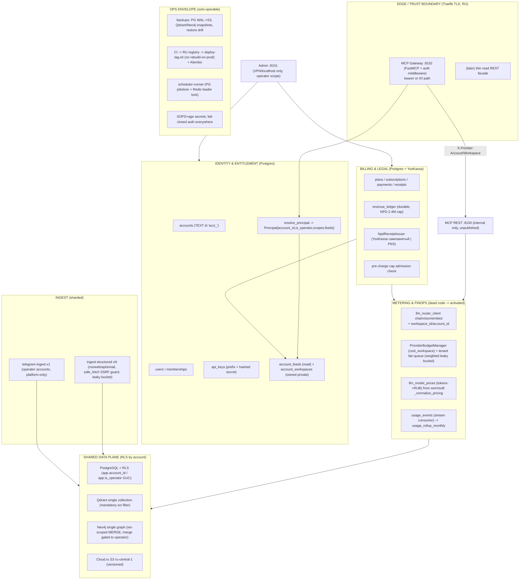

# Обзор целевой SaaS-архитектуры

> **Статус:** проект / план (НЕ реализовано). Документ описывает целевую SaaS-трансформацию Frontier Intelligence.
> **Дата:** 2026-06-26 · Сгенерировано многоагентным анализом текущей сборки. Индекс: [README](./README.md)

# Frontier Intelligence SaaS — Target Architecture Overview

## 1. The vision

Frontier Intelligence is an analytically mature, single-operator trend-intelligence engine (5 connectors → Redis Stream → stateless LangChain/GigaChat enrichment → PostgreSQL + Qdrant + Neo4j + S3 → ~30 MCP tools over an SSE gateway). The audit confirmed one thing: **the analytics are done; the commerce layer is missing entirely.** There is no identity, no auth, no payments, no durable usage ledger, and per-tenant metering is dead code.

The product we are building is a **hybrid B2B intelligence-feeds SaaS**: the 5 curated workspaces (`disruption`, `ai_trends`, `ai_research`, `ai_products_media`, `design`) become subscribable feeds consumed inside Claude/Cursor over MCP, plus limited self-serve RSS/web/api custom sources on the top tier. Telegram stays platform-curated-only (shared accounts, FloodWait blast radius); email self-serve is permanently excluded (plaintext IMAP creds).

## 2. The business shape the law dictates

The operator runs as **самозанятый (НПД)**: revenue cap **2.4M RUB/yr (~200k RUB/mo MRR)**, **no employees**, NPD receipts via YooKassa самозанятый flow (no 54-FZ ККТ). Two consequences shape every architectural choice:

- **Few high-ASP B2B subscriptions, not high-volume self-serve.** To fill the cap you need either ~51 Pulse accounts (3 900 ₽) or ~3 Custom accounts (59 900 ₽). A solo operator cannot support 51 accounts but trivially supports 6–10. The recommended steady-state book (`pricing-packaging-gtm` §3.3) is ~6 subscriptions blending Pro/Studio/Custom at ~175k MRR (88% of cap), ~78% blended gross margin — because the expensive enrichment is *shared* across all readers, so a marginal subscriber costs only their synthesis calls (~90%+ margin, `pricing-packaging-gtm` §3.1).
- **Everything must be automation-first and solo-operable.** The current hand-ops model (rsync + rebuild-on-prod, single-process APScheduler, zero backups) is the #1 existential risk for a paid one-person SaaS (`ops-ha-compliance` §0). No runbook may assume a second human.

**Thesis:** because shared-corpus subscriptions carry ~90% gross margin and the НПД cap rewards ASP over volume, the right shape is a *small portfolio of higher-priced B2B feed subscriptions* — which simultaneously keeps support load solo-survivable, keeps the LLM cost a rounding error, and makes included-credit pricing (not cost-plus metering) the correct, predictable customer model. The metering exists for fairness and the revenue-cap guardrail, not cost recovery.

## 3. Target architecture at a glance

## 4. How the pieces fit (the load-bearing integrations)

- **Hybrid feed model.** A `workspace` stops being "the tenant" and becomes a *physical data partition*: `kind='shared'` (curated feed, read by many accounts via `account_feeds`) or `kind='private'` (owned by one account via `account_workspaces`, created only when a Custom-tier customer adds self-serve RSS/web/api). The `feeds` catalog table maps 1 shared workspace → 1 sellable SKU with `min_tier`. The 5 slugs keep their TEXT PK forever, so existing Claude/Cursor clients never change their config string (`tenancy-data-model` §1, §5). Self-serve safety (SSRF allowlist, per-tier `extra` clamp, outbound leaky bucket, ToS attestation, robots.txt) lives at the single `build_httpx_client` chokepoint (`sources-feeds-product` §4).

- **Platform-pooled LLM + per-tenant metering.** The reusable schema is already tenant-ready — `ExecutionReceipt`/`ProviderExecutionRequest` carry `workspace_id` (verified `""` at `llm_control_plane.py:258,455,486,545`), and `ProviderBudgetManager` already has a `cost_workspace` FinOps scope and `snapshot_costs(workspace_ids=...)`. Activation is **pure wiring**: thread `workspace_id`/`account_id` through `chat/vision/embed`, set it on every receipt, and the dead path lights up. Then convert tokens→RUB with the only real price table (`wormsoft_limits._normalize_pricing`, fetched but never applied), and emit a durable `usage_events` ledger via a Redis-stream consumer (the volatile 3-day Redis keys cannot reconstruct a billing month). A weighted leaky bucket keyed by `workspace_id` (reusing `openrouter_picker`'s proven Lua) replaces the global single-flight guard, giving per-tenant fairness with tier-weighted QoS (`metering-billing-engine` A–F, `ops-ha-compliance` §3, `pricing-packaging-gtm` §1.1).

- **YooKassa + НПД.** YooKassa recurrent (saved `payment_method_id`) drives monthly charges from the externalized scheduler; every `payment.succeeded` writes `revenue_ledger` and auto-issues an НПД чек behind an `NpdReceiptIssuer` protocol (YooKassa самозанятый preferred, FNS "Мой налог" as fallback). A **pre-charge cap admission check inside the same DB transaction** makes it impossible for an automated charge to cross 2.4M — near-cap renewals pause rather than charge. Card data never touches the DB (we hold only the YooKassa method token); 152-FZ PDn gating pins Telegram-derived content to RU providers or pseudonymizes before non-RU egress (`payments-legal` §2–4, `ops-ha-compliance` §7).

## 5. The one boundary that ties it together: server-side workspace resolution

Today `workspace` is client-controlled free text defaulting to `"disruption"`, so any caller reads/mutates any workspace and can trigger irreversible Neo4j merges. The fix is a single rule enforced at the edge across all designs: **the API key is the account; the client-supplied `workspace` becomes a hint, validated against entitlement (`app_visible_workspace`) and overridden, never trusted.** This one change closes the cross-tenant read/merge vulnerability, and the resolved slug becomes the `workspace_id` that flows into RLS GUC, the Qdrant/Neo4j filters, and the metering `cost_workspace` scope — so identity, isolation, and billing all key off the same resolved principal (`auth-serving-surface` §2.3, `tenancy-data-model` §5).

